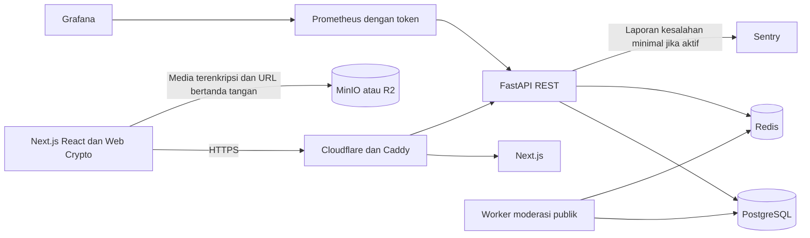

# Arsitektur dan keamanan data Untukmu

Next.js menyediakan halaman dan runtime TypeScript/React. Canvas Three.js menjalankan visualisasi melalui React Three Fiber. FastAPI menyediakan REST `/api/v1`; SQLAlchemy memakai PostgreSQL; Redis menyediakan cache, pembatasan laju dan sinyal worker; MinIO/R2 menyimpan objek. Caddy menyediakan reverse proxy dan TLS produksi. Cloudflare dapat menangani DNS/CDN/WAF/Turnstile pada domain operator.

## Batas enkripsi

Kata sandi diproses Argon2id pada worker browser. Kunci turunan membungkus kunci akun AES-256; server menyimpan rekaman kunci yang dibungkus, tidak kunci asli. Kredensial autentikasi memakai derivasi terpisah dan di-hash Argon2id lagi di server. Isi pesan privat dan unlisted, foto, nama/MIME berkas, dan lampiran dienkripsi menggunakan AES-256-GCM dengan IV acak 12 byte dan AAD yang mengikat identitas objek.

Pesan publik anonim sengaja diberikan dalam bentuk terbaca kepada layanan untuk moderasi dan pembacaan publik. Layanan menyandikannya saat tersimpan menggunakan kunci publik layanan. Kerahasiaan dari layanan berlaku untuk privat dan unlisted; menyebutnya berlaku untuk pesan publik akan bertentangan dengan fitur Jelajah/moderasi PRD.

Tautan unlisted memakai ciphertext kedua dan kunci berbagi baru, berbeda dari kunci akun. Server hanya menerima ciphertext dan menyimpan hash token akses. Kunci berbagi berada setelah `#` dan tidak dikirim pada permintaan HTTP/API. Penerima mendekripsi di browser tanpa akun. Rotasi tautan, pencabutan, edit pesan, atau perubahan privasi mencabut token lama. Server menahan akses sampai `release_at`. Penerima yang sudah membaca dapat menyimpan salinan; pencabutan tidak menghapus salinan tersebut.

Pesan unlisted lama dengan format `server-A256GCM` tetap disimpan, dibaca hanya oleh pemilik, lalu dienkripsi ulang di perangkat ketika pemilik masuk. Migrasi mencabut tautan lama. Jika jaringan atau pembatasan laju menunda konversi, pemilik tetap dapat masuk dan membaca pesan; pemberitahuan meminta masuk kembali untuk melanjutkan. Ekspor tetap menyertakan data asli. Tidak ada migrasi yang mengubah pesan privat menjadi publik.

## Struktur data

| Entitas | Relasi dan fungsi |
| --- | --- |
| User | Surel unik, hash kredensial, peran user/admin, pengaturan privasi, rekaman kunci terbungkus, verifier pemulihan. |
| Session | Milik user; hash refresh token, masa berlaku, pencabutan, informasi perangkat dan waktu aktivitas. |
| Constellation | Milik user; jenis/nama tujuan, kategori khusus, foto terenkripsi atau simbol, bentuk/warna/radius visual. |
| Message | Milik penulis; ciphertext privat/unlisted atau isi publik disandikan layanan, IV/AAD/metadata, privasi, status moderasi, atribut, waktu pembukaan, token/payload berbagi. Constraint menjaga batas ciphertext versus isi publik. |
| MessageConstellation | Relasi banyak-ke-banyak untuk pesan ke beberapa tujuan. |
| Upload dan MessageAttachment | Referensi objek, ukuran ciphertext, status unggah selesai; akses hanya pemilik. |
| Prayer dan PrayerContent | Doa nyata yang selesai; satu pengenal pengunjung per pesan. Katalog teks/sumber, hasil kurasi, audio dan atribusi. |
| Report dan ModerationDecision | Laporan, keputusan admin, alasan, waktu tinjau. Token revisi mencegah persetujuan atas pesan yang sudah diubah. |
| Block dan Empathy | Blok dua arah pada akses publik; empati idempoten tanpa peringkat/suka publik. |
| StorageDeletion | Antrean tahan gagal untuk menghapus objek akun yang dihapus. |

SQLAlchemy menjalankan migrasi Alembic bertahap. Penghapusan akun hanya mengikuti pilihan pemilik; konten yang dipertahankan kehilangan relasi identitas dan tetap mempertahankan batas privasi. Worker hanya membuka konten publik anonim.

## Operasional dan metrik

Endpoint metrik Prometheus memerlukan token terpisah dan tidak dipublikasikan gateway. Label hanya metode, pola rute, dan status; tidak memuat UUID, surel, token, payload atau parameter kueri. Grafana disediakan melalui profile monitoring dan login admin. Sentry memakai allowlist jenis kesalahan/waktu/lingkungan tanpa request, SQL, stack variables, breadcrumbs atau identitas.

Metrik produk hanya dapat diakses admin. Rasio tanpa sampel menjadi `null`, bukan 0% atau klaim keberhasilan. Retensi dihitung dari akun yang berumur setidaknya tujuh hari dengan sesi yang kembali aktif setelah hari ketujuh. Audit keamanan independen dilaporkan terpisah dari jumlah permintaan dan tidak dianggap selesai oleh tes unit.
